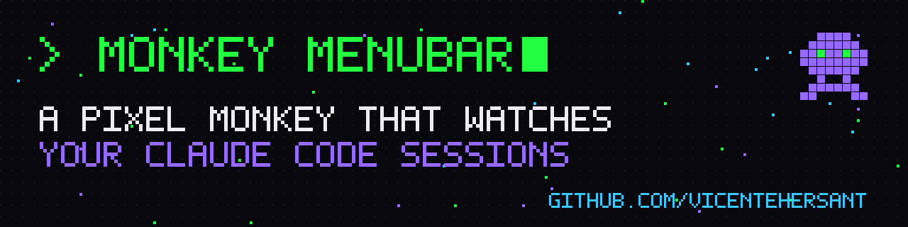

# Monkey (menubar)

Menu-bar mascot for Agents-OS / Monkey OS: a pixel-brand **monkey** that shows what
your Claude Code sessions are doing — idle, working, asking you, finished — without
checking every terminal tab.

> **Forked from [Maxing5/termi-app](https://github.com/Maxing5/termi-app), MIT.**
> Original copyright retained in `LICENSE`. Upstream README kept as `UPSTREAM-README.md`
> for the full feature/behaviour reference.

## What changed vs Termi
- Mascot redrawn as a monkey (SwiftUI shapes, no assets): head, ears, violet face mask,
  neon-green pixel eyes, torso, paws, hooked tail. Palette from `Monkey OS app/Monkey-os-logo.png`.
- Same 5 states + animations: idle (breathe, blink, tail sway) · working (bob, typing paws,
  eye scan, faster tail) · asking (jumps with `?`, tail up) · done (3 decaying hops with `✓`)
  · no sessions (hidden).
- Kept untouched: badges (total / asking / done), sounds + notifications, session popover
  (`⌘↓/⌘↑`, `⌘↩` jump to Terminal tab), preferences, login item, process discovery.
- Renamed: product/target `Monkey`, bundle id `com.vhs.monkey`, state dir
  `~/.claude/monkey/sessions/`, hook `monkey-state.sh`, env override `MONKEY_DIR`.
- Upstream update checker disabled (`UpdateChecker.updatesFromUpstreamEnabled = false`).
- Menu-bar icon: `pawprint.fill`.

## Mascot styles (Preferences → Mascot)
- **Pixel** (default for new installs): 24×24 sprite drawn as crisp cells (half-point
  snapped, scales with the size control), palette shared with the logo. Sprites are
  character maps in `Sources/Monkey/PixelMascotView.swift` (`PixelSprites`) — edit the
  strings, no image assets. Stepped 8 fps animation per state: idle (1px breathe, blink,
  tail flick) · working (typing paws, eyes scanning pixel by pixel) · asking (stepped jump,
  pixel `?`) · done (3 decaying hops, pixel `✓`, sparkles). State changes dissolve/scatter
  the old sprite into the new one. Badges use a 3×5 pixel font.
- **Classic**: the original SwiftUI vector rig with continuous animation.
- Both honor macOS **Reduce Motion**: still key frames, static colours, no blink/pulse.

## Motion policy (Preferences → Mascot → Motion)
- **Minimal** (default): idle and working are still poses (working = paws at the keyboard +
  cyan eyes/halo). Motion only on events: entering *asking* → one jump with `?`, then still
  (a single nudge at most every 30 s while still asking) · entering *done* → one ≤1.5 s
  celebration (hops + `✓`), then still · hover/click on the mascot, opening the popover or
  starting a rename → a small one-shot wave/glance. Occasional blink every 6–10 s.
- **Lively**: restores continuous idle/working animation (slowed: Pixel 6 fps steps,
  Classic eased).
- Reduce Motion = no animation at all, regardless of this setting.

## State colour system (`Sources/Monkey/StateColors.swift`, both styles)
One palette drives the eyes, the aura around the mascot (Classic: soft glow · Pixel:
1px lit outline, stepped) and the menu-bar pawprint (template icon when idle so it
follows light/dark; tinted otherwise):
idle = dim neon green `#21FF40`, slow breathe · working = cyan `#3BC7FF`, pulse synced to
typing · asking = badge orange, blinking · done = badge green, sparkle fading over ~4s ·
stale (every session is a `working` whose heartbeat died) = grey, dimmed eyes.
Fur keeps the logo colours; poses/glyphs remain the non-colour signal.

## Session names
Double-click a row in the popover (or ⌘R on the highlighted row, or right-click →
Rename…) to rename a session inline; Enter saves, Esc cancels, empty resets to the
default. Default = Claude Code's own `/rename` title when the transcript has one,
else the folder name. Names persist in `~/.claude/monkey/names.json` (see
STATE-CONTRACT.md) and are used in rows, notifications and tooltips; entries of
sessions gone for 7+ days are pruned.

Session file schema is identical to Termi's — see **STATE-CONTRACT.md** (Monkey OS console
reads the same files).

## Coexists with Termi
Different hook script name (`monkey-state.sh`), state dir, bundle id, login-item label,
settings backup (`settings.json.monkey-backup`). `install.sh` only replaces hook entries whose
command contains `monkey-state.sh`; Termi's `termi-state.sh` entries are left alone. Both
apps can run side by side (each gets its own hooks firing).

## Install (needs Vicente's approval — edits ~/.claude/settings.json)
```sh
cd ~/Desktop/Agents-OS/apps/monkey-menubar && ./install.sh          # add --dock to pin it
open -a /Applications/Monkey.app
```
Requires macOS 14+, Xcode CLT, `jq`. Installs to `/Applications/Monkey.app` (override with
`MONKEY_APP_DIR`); an older copy in `~/Applications` is removed and the login item is
re-pointed on next launch. App icon is built from `Monkey OS app/Monkey-os-logo.png` by
`make-icon.sh`. Opening the app again while running shows the mascot and the session
list; "Show in Dock while running" (Preferences → Mascot) is optional.

## Dev
```sh
swift build && ./demo.sh                     # tour every state in an isolated temp dir
MONKEY_APP_DIR="$PWD/build" ./make-app.sh    # bundle without touching /Applications
hooks/monkey-fake.sh asking demo             # fake session in the real dir; `clear` to remove
```
Optional usage-limit % in popover: `./install-statusline.sh` (wraps your statusline script).
